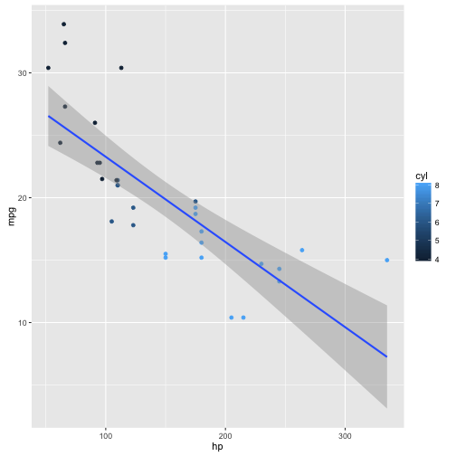

Data Analysis of Automobile Carbon Footprint 
====
author: J Faleiro
date: May 5 2014
autosize: true

The Data
===

- This small application demonstrates ad hoc data investigation in features related to the carbon footprint of mid-70's automobiles
- This data was extracted from the 1974 issue of Motor Trend, an US automobile magazine. 
- The data comprises fuel consumption and 10 aspects of automobile design and performance for 32 automobiles (1973–74 models). 

Summary
===

```r
data(mtcars)
knitr::kable(head(mtcars,5))
```


|                  |  mpg| cyl| disp|  hp| drat|    wt|  qsec| vs| am| gear| carb|
|:-----------------|----:|---:|----:|---:|----:|-----:|-----:|--:|--:|----:|----:|
|Mazda RX4         | 21.0|   6|  160| 110| 3.90| 2.620| 16.46|  0|  1|    4|    4|
|Mazda RX4 Wag     | 21.0|   6|  160| 110| 3.90| 2.875| 17.02|  0|  1|    4|    4|
|Datsun 710        | 22.8|   4|  108|  93| 3.85| 2.320| 18.61|  1|  1|    4|    1|
|Hornet 4 Drive    | 21.4|   6|  258| 110| 3.08| 3.215| 19.44|  1|  0|    3|    1|
|Hornet Sportabout | 18.7|   8|  360| 175| 3.15| 3.440| 17.02|  0|  0|    3|    2|

Data Analysis 
===

- Select features by moving the `Predictor` and the `Outcome` drop bown boxes 
- The dashboard will show a linear interpolation between the features selected. 
- The shaded area represents the **95% confidence interval** of the linear prediction.
- You can additionally select a `Clustered` featured in the third drop-down box to add colors to points as a way to help visualize clusters.

Sample Visualization & Data Insights
====

- The outcome `mpg` is negativelly correlated to all regressors
- All regressors are positivelly correlated amongst themselves
- This application is available for use [here](https://jfaleiro.shinyapps.io/carbonfootprint/)

***


